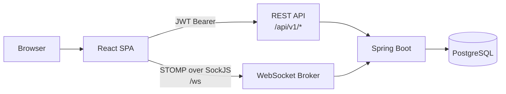

<div align="center">

# PulseHub

### Real-time communication platform with messaging, online presence, notifications and event-driven architecture built using Java, Spring Boot and WebSockets

[](https://openjdk.org/)
[](https://spring.io/projects/spring-boot)
[](https://react.dev/)
[](https://www.typescriptlang.org/)
[](https://www.postgresql.org/)
[](https://www.docker.com/)
[](#-license)

</div>

---

## 📖 About the project

**PulseHub** is a real-time communication platform: sign up, see who else is online, and chat 1:1 or in named groups with live typing indicators, presence and read receipts — all over a JWT-authenticated STOMP/WebSocket connection, not polling.

> Sign in ➜ see your **contacts' presence** (online / away / offline) ➜ open a **private chat** or create a **group** ➜ messages, typing state, read receipts and presence all arrive **instantly**, pushed from the server.

This repository is a **monorepo** containing both halves of the system:

| Package | Description | Docs |
|---|---|---|
| [`backend/`](backend) | Spring Boot 3 API — JWT auth, STOMP over WebSocket, PostgreSQL + Flyway | [backend/README.md](backend/README.md) |
| [`frontend/`](frontend) | React + TypeScript SPA — STOMP.js/SockJS client, TanStack Query, Zustand | [frontend/README.md](frontend/README.md) |

---

## ✨ Features

```
✅ JWT Authentication

✅ Private Messaging

✅ Online Presence

✅ Typing Indicator

✅ Read Receipts

✅ Real-time Notifications

✅ User Status

✅ User Profile

✅ Group Conversations

✅ Voice Messages

✅ Push Notifications

✅ Docker

✅ CI/CD
```

---

## 🚀 Quick start (full stack, with Docker)

```bash
git clone https://github.com/duanjesus/pulsehub.git
cd pulsehub
docker compose up --build
```

| Service  | URL                                      |
|----------|-------------------------------------------|
| Frontend | http://localhost:3000                     |
| API      | http://localhost:8080                     |
| Swagger  | http://localhost:8080/swagger-ui.html      |
| Postgres | localhost:5432                             |

The `web` container (nginx) serves the built React app and proxies `/api/*`, `/ws/*` and `/uploads/*` calls to the `api` container. Open the frontend in **two different browsers (or one normal + one private window)**, sign up two accounts, and message between them — including a voice note (click the microphone) — to see presence, typing, read receipts and notifications update live. Enable push notifications from the Profile page to get a real OS-level notification the next time someone messages you, even with the tab closed.

## 🧪 Local development (without Docker)

```bash
# 1. Database only
docker compose up -d db

# 2. Backend (terminal 1)
cd backend
mvn spring-boot:run

# 3. Frontend (terminal 2)
cd frontend
npm install
npm run dev
```

Frontend dev server: http://localhost:5173 (Vite proxies `/api` and `/ws` to `http://localhost:8080`).

---

## 🏗️ Architecture



REST carries anything a page needs to load once (auth, contact list, message history, dashboard). The WebSocket broker carries anything that needs to *arrive* rather than be *fetched* — new messages, typing state, presence changes. Both sides talk to the same Spring Boot application; the diagram below shows exactly which STOMP destination does what.

```
┌────────────┐   JWT (Bearer)    ┌──────────────────────┐
│   React     │ ────────────────▶│   Spring Boot API      │
│   SPA       │◀──────────────── │   REST  (/api/v1/*)    │
└─────┬──────┘   JSON responses  └──────────┬────────────┘
      │                                     │
      │ STOMP over SockJS (/ws)             │
      │ CONNECT carries the same JWT        │
      ▼                                     ▼
┌────────────────────────────────────────────────────┐
│           Spring WebSocket message broker           │
│  /app/chat.send, /app/chat.typing   (client → server)│
│  /user/queue/messages, /user/queue/typing (private)  │
│  /topic/presence                     (public)         │
└──────────────────────┬───────────────────────────────┘
                        │
                        ▼
                 ┌─────────────┐
                 │  PostgreSQL   │  users · conversations · messages
                 └─────────────┘
```

See [backend/README.md](backend/README.md) for the full real-time sequence diagram.

---

## 🗺️ Roadmap

- [x] **V1** — JWT auth, contacts with live presence (online/away/offline), private 1:1 chat, typing indicator, dashboard
- [x] **V2** — Real-time read receipts, a persisted notification center (bell + dashboard, pushed over WebSocket), and a user profile (display name, password change, avatar upload)
- [x] **V3** — Group conversations: named groups with OWNER/MEMBER roles, add/remove members, leave (with automatic owner hand-off), and typing/read-receipts generalized to N participants ("Read 2/4")
- [x] **V4** — Voice messages (record/upload/playback) and real Web Push notifications (service worker + VAPID, delivered even when the tab is closed)
- [ ] **V5** — Video call foundation (WebRTC signaling relayed over STOMP, minimal call UI — not a full calling product)
- [ ] **V6** — Redis pub/sub as the STOMP broker relay, proven with 2+ backend replicas behind a load balancer (horizontal scaling)

---

## 📸 Screenshots

| | |
|---|---|
| **Sign in** | **Dashboard** |
|  |  |
| **Direct chat** — voice message, read receipts | **Group chat** — members panel, roles |
|  |  |
| **Profile** — avatar, password, push notifications | |
|  | |

---

## 🏗️ Repository layout

```
pulsehub/
├── backend/            # Spring Boot API (Java 21, WebSocket/STOMP, PostgreSQL, Flyway, JWT auth)
│   ├── src/
│   ├── pom.xml
│   ├── Dockerfile
│   └── README.md
├── frontend/           # React + TypeScript SPA (Vite, Tailwind, TanStack Query, Zustand, STOMP.js)
│   ├── src/
│   ├── package.json
│   ├── Dockerfile
│   └── README.md
├── docker-compose.yml  # Orchestrates db + api + web together
├── .github/workflows/  # CI: backend build/test, frontend lint/build
└── CLAUDE.md           # Guide for AI coding agents working in this repo
```

Each package is independently runnable and documented — see their READMEs for tech stack details, available scripts, and architecture notes.

---

## 🌱 Commit convention

This project follows **Conventional Commits** (`feat`, `fix`, `refactor`, `docs`, `style`, `test`, `chore`) — see [backend/README.md](backend/README.md#-tests) for the full guide.

---

## 📄 License

Distributed under the MIT License. See `LICENSE` for more information.
