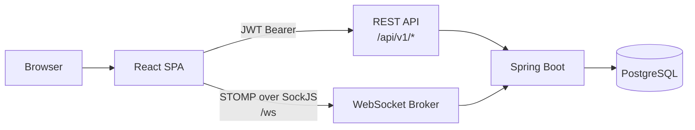
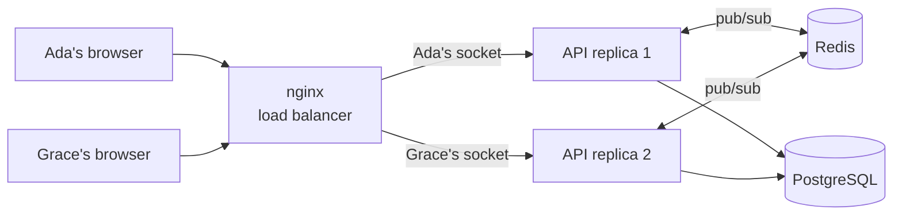
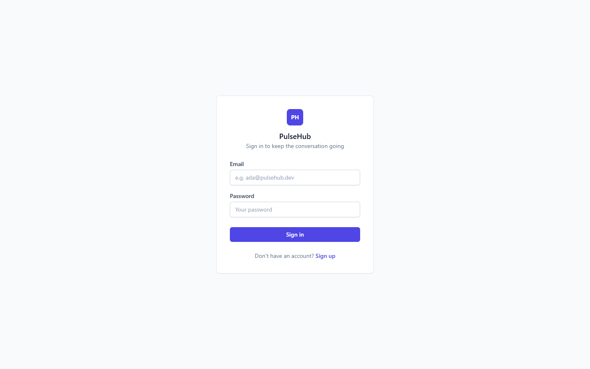
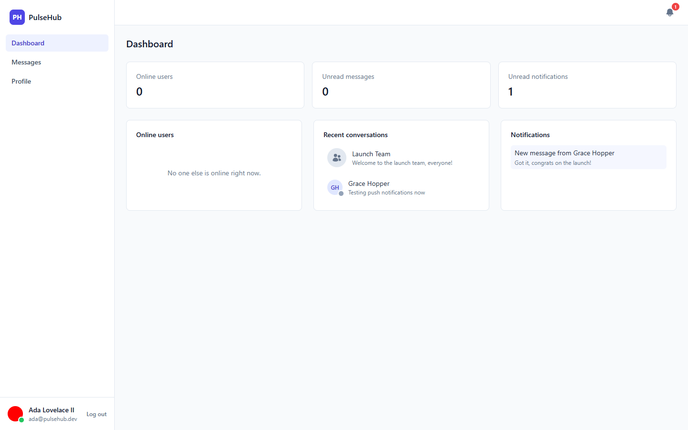
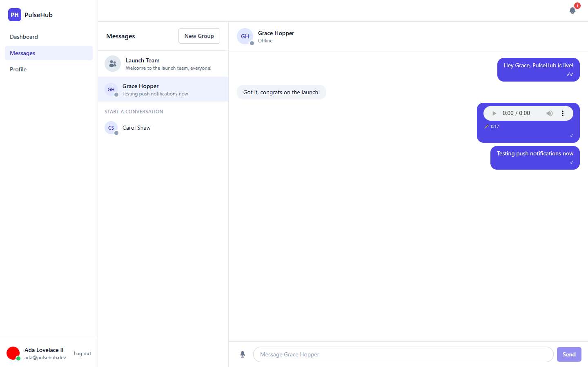
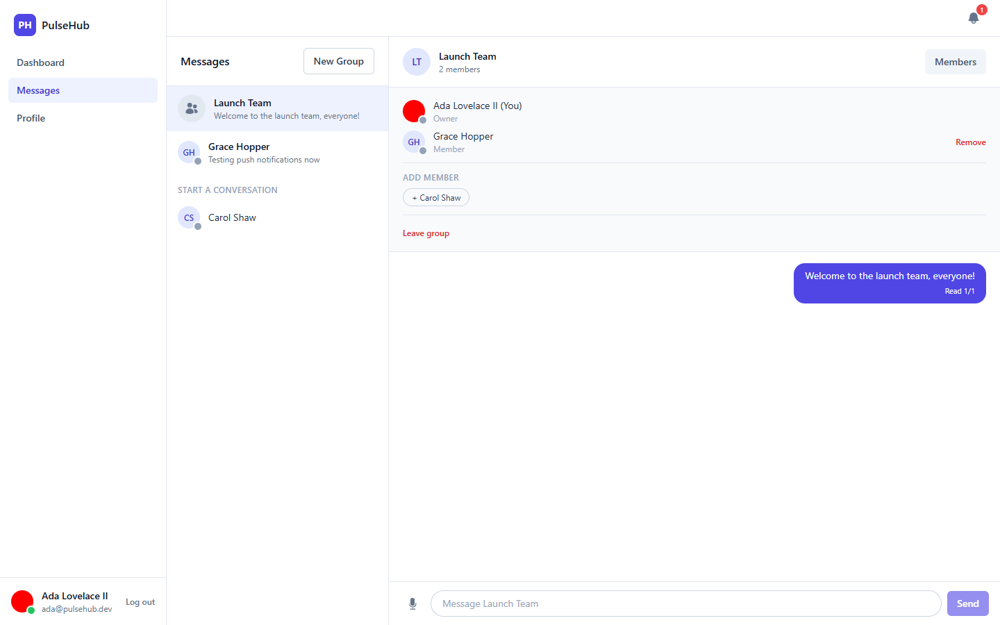
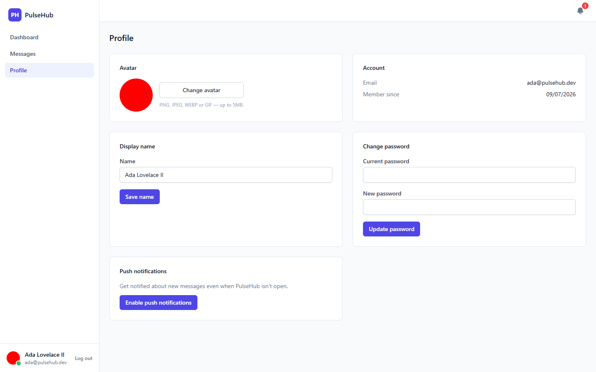
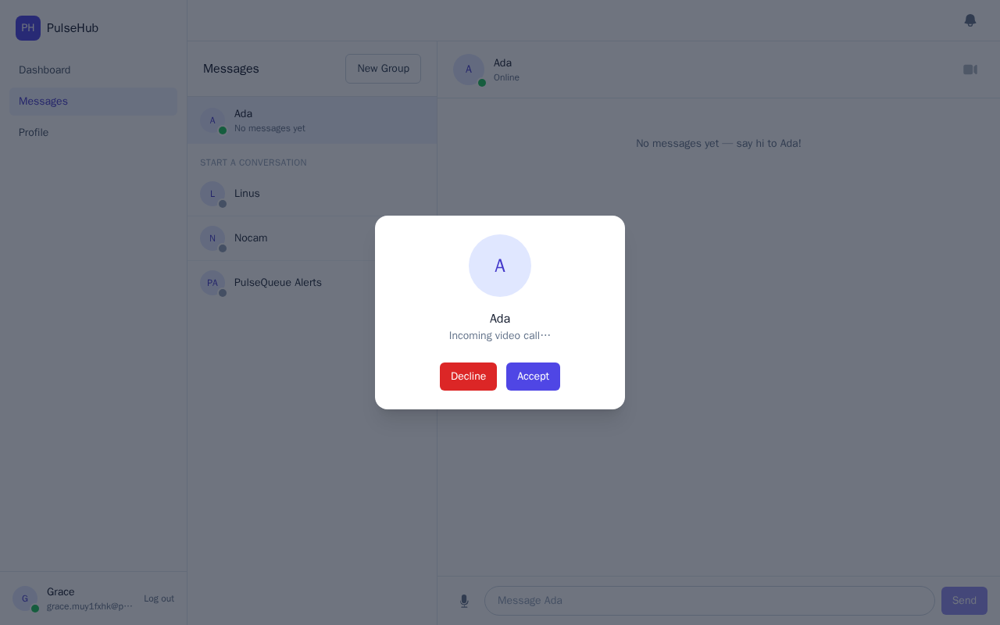
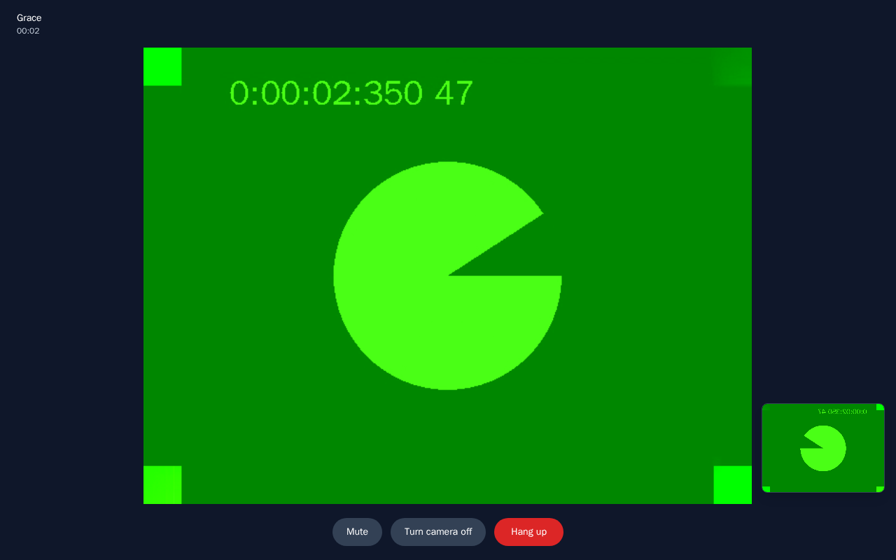

<div align="center">

# PulseHub

### Real-time communication platform with messaging, online presence, notifications and event-driven architecture built using Java, Spring Boot and WebSockets

[](https://openjdk.org/)
[](https://spring.io/projects/spring-boot)
[](https://react.dev/)
[](https://www.typescriptlang.org/)
[](https://www.postgresql.org/)
[](https://www.docker.com/)
[](#-license)

</div>

---

## 📖 About the project

**PulseHub** is a real-time communication platform: sign up, see who else is online, and chat 1:1 or in named groups with live typing indicators, presence and read receipts — all over a JWT-authenticated STOMP/WebSocket connection, not polling. Direct chats can also start a 1:1 video call over WebRTC.

> Sign in ➜ see your **contacts' presence** (online / away / offline) ➜ open a **private chat** or create a **group** ➜ messages, typing state, read receipts and presence all arrive **instantly**, pushed from the server.

This repository is a **monorepo** containing both halves of the system:

| Package | Description | Docs |
|---|---|---|
| [`backend/`](backend) | Spring Boot 3 API — JWT auth, STOMP over WebSocket, PostgreSQL + Flyway, Redis pub/sub between replicas | [backend/README.md](backend/README.md) |
| [`frontend/`](frontend) | React + TypeScript SPA — STOMP.js/SockJS client, TanStack Query, Zustand | [frontend/README.md](frontend/README.md) |

---

## ✨ Features

```
✅ JWT Authentication

✅ Private Messaging

✅ Online Presence

✅ Typing Indicator

✅ Read Receipts

✅ Real-time Notifications

✅ User Status

✅ User Profile

✅ Group Conversations

✅ Voice Messages

✅ Push Notifications

✅ Video Calls (1:1, WebRTC)

✅ Horizontal Scaling (Redis pub/sub + load balancer)

✅ Docker

✅ CI/CD
```

---

## 🚀 Quick start (full stack, with Docker)

```bash
git clone https://github.com/duanjesus/pulsehub.git
cd pulsehub
docker compose up --build
```

| Service  | URL                                      |
|----------|-------------------------------------------|
| Frontend | http://localhost:3000                     |
| API      | http://localhost:8080 (load-balanced)     |
| Swagger  | http://localhost:8080/swagger-ui.html      |
| Postgres | localhost:5432                             |
| Redis    | localhost:6379                             |

This starts **two API replicas** behind nginx. The `web` container serves the built React app and load-balances `/api/*`, `/ws/*` and `/uploads/*` across them; every response carries an `X-PulseHub-Instance` header, so the browser's network tab shows which replica answered. Try `docker compose up -d --scale api=3`: the third replica starts taking traffic without touching nginx. See [Horizontal scaling](#-horizontal-scaling) below. Open the frontend in **two different browsers (or one normal + one private window)**, sign up two accounts, and message between them — including a voice note (click the microphone) — to see presence, typing, read receipts and notifications update live. Click the camera icon in a direct chat to start a video call between the two (on one machine with one webcam, the second browser may fall back to voice only if the first is holding the camera). Enable push notifications from the Profile page to get a real OS-level notification the next time someone messages you, even with the tab closed.

## 🧪 Local development (without Docker)

```bash
# 1. Database and Redis only
docker compose up -d db redis

# 2. Backend (terminal 1)
cd backend
mvn spring-boot:run

# 3. Frontend (terminal 2)
cd frontend
npm install
npm run dev
```

Frontend dev server: http://localhost:5173 (Vite proxies `/api` and `/ws` to `http://localhost:8080`).

---

## 🏗️ Architecture



REST carries anything a page needs to load once (auth, contact list, message history, dashboard). The WebSocket broker carries anything that needs to *arrive* rather than be *fetched* — new messages, typing state, presence changes, and the signaling for video calls. A call's audio and video never touch the server: the broker only relays the WebRTC handshake, and the two browsers then talk to each other directly. Both sides talk to the same Spring Boot application; the diagram below shows exactly which STOMP destination does what.

```
┌────────────┐   JWT (Bearer)    ┌──────────────────────┐
│   React     │ ────────────────▶│   Spring Boot API      │
│   SPA       │◀──────────────── │   REST  (/api/v1/*)    │
└─────┬──────┘   JSON responses  └──────────┬────────────┘
      │                                     │
      │ STOMP over SockJS (/ws)             │
      │ CONNECT carries the same JWT        │
      ▼                                     ▼
┌────────────────────────────────────────────────────┐
│           Spring WebSocket message broker           │
│  /app/chat.send, /app/chat.typing   (client → server)│
│  /app/call.signal                   (client → server)│
│  /user/queue/messages, /user/queue/typing (private)  │
│  /user/queue/calls                  (private)        │
│  /topic/presence                     (public)         │
└──────────────────────┬───────────────────────────────┘
                        │
                        ▼
                 ┌─────────────┐
                 │  PostgreSQL   │  users · conversations · messages
                 └─────────────┘
```

See [backend/README.md](backend/README.md) for the full real-time sequence diagram.

---

## 📈 Horizontal scaling

A WebSocket lives on one server. With two API replicas, Ada's socket can be on replica 1 and Grace's on replica 2 — and a message Ada sends is handled by replica 1, whose broker has never heard of Grace. Solving that is what makes the real-time half scale out.



- **Redis pub/sub relays every outbound frame.** Nothing in the application pushes to a browser directly. It publishes the frame to one Redis channel; every replica receives it and hands it to its own in-memory STOMP broker, which delivers to the sessions it actually holds and drops the rest. Messages, typing, read receipts, notifications, presence and call signaling all take this one path.
- **nginx is the load balancer.** It re-resolves the `api` service through Docker's DNS, so replicas can be added, removed or replaced without a reload. REST calls are round-robined; SockJS traffic is hashed on the session id, which keeps all requests of one session on one replica while spreading sessions across replicas.
- **Nothing else is per-instance.** Auth is a stateless JWT, presence lives in PostgreSQL, the call-signaling relay keeps no state, and the scheduled presence job takes a short Redis lock so only one replica runs it per tick.

**Proven, not just wired.** [`e2e/multi-replica.mjs`](e2e/multi-replica.mjs) drives real browsers against the running stack and reads the `X-PulseHub-Instance` header off each WebSocket handshake to make sure two users really are on different replicas. It then checks that a message, its read receipt, its notification, a typing indicator, a presence change and a full video call all cross between them — and, mid-call, **kills the replica holding one user's socket**: the video keeps playing (media is peer to peer), the socket reconnects through the load balancer to the surviving replica, the call is hung up through it, and chat flows again.

What it doesn't do: a frame published while a browser is between sockets is not replayed (the client refetches over REST when it reconnects instead); presence is tracked per user, not per session, so with two tabs open, closing one shows you offline even though the other is still connected; and uploads sit on a Docker volume both replicas mount, which works on one host but would need object storage across several.

---

## 🗺️ Roadmap

- [x] **V1** — JWT auth, contacts with live presence (online/away/offline), private 1:1 chat, typing indicator, dashboard
- [x] **V2** — Real-time read receipts, a persisted notification center (bell + dashboard, pushed over WebSocket), and a user profile (display name, password change, avatar upload)
- [x] **V3** — Group conversations: named groups with OWNER/MEMBER roles, add/remove members, leave (with automatic owner hand-off), and typing/read-receipts generalized to N participants ("Read 2/4")
- [x] **V4** — Voice messages (record/upload/playback) and real Web Push notifications (service worker + VAPID, delivered even when the tab is closed)
- [x] **V5** — Video call foundation: 1:1 calls in direct conversations, WebRTC signaling relayed over STOMP by a stateless server, voice-only fallback without a camera, and a minimal call UI (ring, accept/decline, mute, camera, hang up). Not a full calling product — no TURN server, no group calls, no call history
- [x] **V6** — Horizontal scaling: Redis pub/sub relays every real-time frame between API replicas, nginx load-balances them with per-session stickiness and live replica discovery, and an end-to-end check proves delivery across replicas and survival of a replica crash mid-call

---

## 📸 Screenshots

| | |
|---|---|
| **Sign in** | **Dashboard** |
|  |  |
| **Direct chat** — voice message, read receipts | **Group chat** — members panel, roles |
|  |  |
| **Profile** — avatar, password, push notifications | **Incoming call** |
|  |  |
| **Video call** — remote video, local preview, controls | |
|  | |

The video-call screenshot comes from the automated end-to-end check, so both "cameras" are Chromium's synthetic test pattern rather than real webcams — the video itself is a real WebRTC stream between two browsers.

---

## 🏗️ Repository layout

```
pulsehub/
├── backend/            # Spring Boot API (Java 21, WebSocket/STOMP, PostgreSQL, Flyway, JWT auth)
│   ├── src/
│   ├── pom.xml
│   ├── Dockerfile
│   └── README.md
├── frontend/           # React + TypeScript SPA (Vite, Tailwind, TanStack Query, Zustand, STOMP.js)
│   ├── src/
│   ├── package.json
│   ├── Dockerfile
│   └── README.md
├── e2e/                # Playwright checks on real browsers: video calls, multi-replica delivery and failover
├── docker-compose.yml  # Orchestrates db + redis + 2 api replicas + web (nginx, also the load balancer)
├── .github/workflows/  # CI: backend build/test, frontend lint/build
└── CLAUDE.md           # Guide for AI coding agents working in this repo
```

Each package is independently runnable and documented — see their READMEs for tech stack details, available scripts, and architecture notes.

---

## 🌱 Commit convention

This project follows **Conventional Commits** (`feat`, `fix`, `refactor`, `docs`, `style`, `test`, `chore`) — see [backend/README.md](backend/README.md#-tests) for the full guide.

---

## 📄 License

Distributed under the MIT License. See `LICENSE` for more information.
